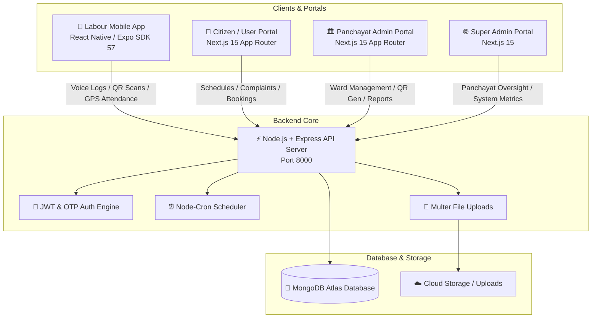
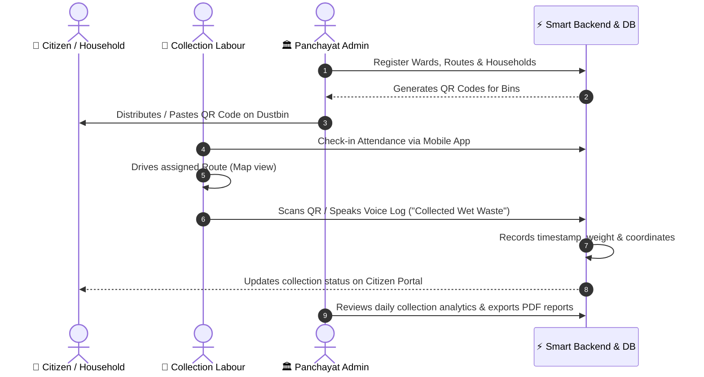

# ♻️ Smart Garbage Collection & Waste Management System

[](https://nodejs.org/)
[-000000?logo=next.js&logoColor=white)](https://nextjs.org/)
[](https://expo.dev/)
[](https://www.mongodb.com/)
[](https://tailwindcss.com/)
[](LICENSE)

An enterprise-grade, end-to-end IoT and mobile-enabled **Smart Garbage Collection and Waste Management Platform**. Built to modernize municipal and local Panchayat waste operations through real-time GPS tracking, QR-code dustbin logging, **voice-assisted collection for field staff**, automated reporting, citizen grievance management, and multi-tier administrative dashboards.

---

## 📑 Table of Contents

- [System Architecture](#-system-architecture)
- [Project Modules Overview](#-project-modules-overview)
- [Key Features](#-key-features)
- [How the System Works (End-to-End Workflow)](#-how-the-system-works-end-to-end-workflow)
- [Prerequisites](#-prerequisites)
- [Quick Start Guide](#-quick-start-guide)
  - [1. Backend Server](#1-backend-server)
  - [2. User / Citizen Frontend](#2-user--citizen-frontend)
  - [3. Panchayat Admin Frontend](#3-panchayat-admin-frontend)
  - [4. Super Admin Frontend](#4-super-admin-frontend)
  - [5. Labour Mobile App](#5-labour-mobile-app)
- [Examiner & Test Login Credentials](#-examiner--test-login-credentials)
- [Environment Variables Configuration](#-environment-variables-configuration)
- [Mobile App (Labour App) Build Guide](#-mobile-app-labour-app-build-guide)
- [Backend API Endpoints Summary](#-backend-api-endpoints-summary)
- [Troubleshooting & FAQ](#-troubleshooting--faq)

---

## 🏗️ System Architecture



---

## 📦 Project Modules Overview

The repository is structured into 5 cohesive sub-projects:

| Directory | Module | Technology Stack | Port | Purpose |
| :--- | :--- | :--- | :--- | :--- |
| `backend` | **REST API Server** | Node.js, Express.js (ESM), MongoDB, Mongoose, JWT, Cron | `8000` | Centralized business logic, OTP handling, DB queries, data processing. |
| `user-frontend` | **Citizen / Household Portal** | Next.js 15, React 19, Tailwind CSS v4, Framer Motion | `3002` / `3000` | Public landing page, waste pickup schedule, grievance tracking, segregation guide. |
| `admin-frontend` | **Panchayat Admin Dashboard** | Next.js 15, React 19, Tailwind CSS v4, jsPDF, Recharts | `3000` | Local administration, dustbin registry, QR generation, staff attendance, analytics. |
| `super-admin-frontend` | **Super Admin Master Portal** | Next.js 15, React 19, Tailwind CSS v4, Axios | `3001` | System-wide oversight, multi-panchayat management, subscription tiers, global metrics. |
| `app-frontend` | **Labour / Field Worker App** | React Native 0.86, Expo SDK 57, Expo Speech Recognition | `8081` | On-ground mobile app for garbage collectors with QR scanning, voice logging, and GPS maps. |

---

## ✨ Key Features

### 1. 🎤 Hands-Free Voice-Assisted Collection
- Garbage collectors can record waste collection without typing using native speech recognition (`expo-speech-recognition`).
- Supports voice commands like *"Household 102 collected 2 kg wet waste"*.

### 2. 📷 Smart Dustbin QR Code Generation & Verification
- Admins generate unique QR codes for every household/community dustbin.
- Collectors scan dustbin QR codes in milliseconds using the in-app scanner to verify physical pickup at exact GPS coordinates.

### 3. 🗺️ GPS Route Navigation & Live Dustbin Mapping
- Interactive map view displays pending, in-progress, and collected dustbins on the driver's route.
- Reduces missed collections and optimizes vehicle fuel consumption.

### 4. 🕒 Geofenced Attendance & Worker Verification
- Staff check in/out on the mobile app with location timestamps to ensure accountability.

### 5. 📊 Analytics, Automated PDF & Excel Reporting
- Admins export detailed compliance reports, daily collection logs, and attendance summaries in PDF (via `jspdf-autotable`) and Excel (`xlsx`).

### 6. 🚨 Citizen Grievance & Special Booking System
- Households can report missed pickups, overflow issues, or request special bulky waste collections with photo proof.

### 7. 🔐 Seamless Passwordless OTP Authentication
- Secure phone number + OTP login for all roles (Super Admin, Panchayat Admins, Citizens, and Field Labourers).

---

## 🔄 How the System Works (End-to-End Workflow)



---

## 💻 Prerequisites

Ensure you have the following installed on your development machine:

- **Node.js**: v18.x or v20.x ([Download Node.js](https://nodejs.org/))
- **npm** (comes with Node.js) or **yarn**
- **Git**: For version control
- **MongoDB Atlas** connection string (or local MongoDB server)
- **Expo CLI / EAS CLI** (for mobile development):
  ```bash
  npm install -g eas-cli expo-cli
  ```

---

## 🚀 Quick Start Guide

Open separate terminal windows for each component you wish to run:

### 1. Backend Server

```bash
cd backend
npm install
cp .env.example .env     # Configure MONGO_URI and JWT_SECRET
npm run dev
```
> Server will start at: **`http://localhost:8000`**

---

### 2. User / Citizen Frontend

```bash
cd user-frontend
npm install
cp .env.example .env.local
npm run dev -- -p 3002
```
> Access Citizen Portal at: **`http://localhost:3002`**

---

### 3. Panchayat Admin Frontend

```bash
cd admin-frontend
npm install
cp .env.example .env.local
npm run dev -- -p 3000
```
> Access Admin Portal at: **`http://localhost:3000`**

---

### 4. Super Admin Frontend

```bash
cd super-admin-frontend
npm install
cp .env.example .env.local
npm run dev
```
> Access Super Admin Portal at: **`http://localhost:3001`**

---

### 5. Labour Mobile App

```bash
cd app-frontend
npm install
# Set your computer's LAN IP address in config.js (e.g., http://192.168.1.33:8000/api)
npm start
```
> For testing native modules (Voice Recognition & Camera), see the [Mobile App Build Guide](#-mobile-app-labour-app-build-guide).

---

## 🔑 Examiner & Test Login Credentials

Use the following test credentials to evaluate each portal:

| Portal | Role | Phone Number | Default / Testing OTP | Notes |
| :--- | :--- | :--- | :--- | :--- |
| **Super Admin Portal** (`:3001`) | Super Admin (Master) | `9111111111` | Displayed on screen / `123456` | Master control across all panchayats |
| **Admin Portal** (`:3000`) | Panchayat Admin (Chicalim) | `9222222222` | Displayed on screen / `123456` | Manages Chicalim ward & bins |
| **Admin Portal** (`:3000`) | Panchayat Admin (Mauxi) | `8322374279` | Displayed on screen / `123456` | Manages Mauxi ward & bins |
| **User Portal** (`:3002`) | Household (Chicalim) | `9333333333` | Displayed on screen / `123456` | Citizen pickup schedule & billing |
| **User Portal** (`:3002`) | Household (Chicalim) | `9444444444` | Displayed on screen / `123456` | Citizen pickup schedule & billing |
| **User Portal** (`:3002`) | Household (Mauxi) | `9666666666` | Displayed on screen / `123456` | Citizen pickup schedule & billing |
| **Labour Mobile App** | Worker (Chicalim) | `9876543210` | Displayed on screen / `123456` | Field collector app |
| **Labour Mobile App** | Worker (Mauxi) | `9777777777` | Displayed on screen / `123456` | Field collector app |

> 💡 **Note:** During local testing, OTPs are also printed directly into the **Backend Terminal Console**.

---

## ⚙️ Environment Variables Configuration

Create `.env` or `.env.local` files in each sub-directory:

### `backend/.env`
```env
PORT=8000
MONGO_URI=mongodb+srv://<username>:<password>@cluster.mongodb.net/garbage-collection-db
JWT_SECRET=garbage_collection_secret_2026
NODE_ENV=development
```

### `admin-frontend/.env.local`
```env
NEXT_PUBLIC_API_BASE_URL=http://localhost:8000/api
NEXT_PUBLIC_SUPER_ADMIN_URL=http://localhost:3001
PORT=3000
```

### `super-admin-frontend/.env.local`
```env
NEXT_PUBLIC_API_BASE_URL=http://localhost:8000/api
NEXT_PUBLIC_ADMIN_URL=http://localhost:3000
PORT=3001
```

### `user-frontend/.env.local`
```env
NEXT_PUBLIC_API_BASE_URL=http://localhost:8000/api
PORT=3002
```

### `app-frontend/config.js`
```javascript
// Point to your live backend or your machine's local LAN IP
export const API_URL = 'http://192.168.1.33:8000/api';
```

---

## 📱 Mobile App (Labour App) Build Guide

> ⚠️ **Notice**: The Labour App uses native device capabilities (**`expo-speech-recognition`**, **`expo-camera`**, **`expo-location`**) that require a custom development client or standalone APK rather than standard Expo Go.

### Option A: Build Standalone APK (Recommended)
Generate an installable `.apk` for Android using EAS Cloud:
```bash
cd app-frontend
npm install -g eas-cli
eas login
npm run build:apk
```
*Download the `.apk` from the generated link and install it directly on any Android device.*

### Option B: Build Custom Dev Client
```bash
eas build -p android --profile development
```
*Install the Dev Client APK on your device, then run `npx expo start --dev-client` for live code updates.*

### Option C: Run on Android Emulator / Physical Device via Android Studio
```bash
npm run android
```

---

## 🔌 Backend API Endpoints Summary

| Endpoint Group | Base Route | Key Operations |
| :--- | :--- | :--- |
| **Authentication** | `/api/auth` | User/Admin OTP generation, verification, login, profile retrieval. |
| **Employee Auth** | `/api/employee-auth` | Staff OTP login and credential validation. |
| **Dustbins** | `/api/dustbins` | Create dustbin, fetch by ward, update status, generate QR codes. |
| **Waste Data** | `/api/waste-data` | Log collection (voice/QR), filter by date/ward, aggregate stats. |
| **Attendance** | `/api/attendance` | Check-in, check-out, GPS location logging, attendance history. |
| **Households** | `/api/households` | Household CRUD, assign dustbins, subscription status. |
| **Wards & Routes** | `/api/wards`, `/api/routes` | Boundary definitions, route assignments, collector mapping. |
| **Complaints** | `/api/complaints` | File grievance, attach images, update resolution status. |
| **Schedule Bookings** | `/api/schedule-bookings`| On-demand bulky waste pickup requests. |
| **Panchayat & Company**| `/api/panchayats`, `/api/companies` | Municipal entity onboarding and configuration. |
| **Reports & Analytics** | `/api/reports` | System KPIs, collection efficiency, weight breakdowns. |

---

## ❓ Troubleshooting & FAQ

### 1. Mobile app displays "Network Error" when logging in
- Ensure your mobile device and backend server are connected to the **same local Wi-Fi network**.
- Change `API_URL` in `app-frontend/config.js` from `localhost` to your computer's LAN IP address (e.g. `http://192.168.1.X:8000/api`).
- Ensure port `8000` is not blocked by your OS firewall.

### 2. Where do I find the login OTP?
- If SMS service is not active, the OTP is automatically printed in your **backend terminal console** when requested.
- For test accounts, simple fallback OTPs like `123456` or the on-screen modal code can be used.

### 3. Port conflict when running multiple frontends
- If ports `3000`, `3001`, or `3002` are in use, pass `-p <PORT>` to the Next.js dev server:
  ```bash
  npm run dev -- -p 3005
  ```

---

## 👥 Contributors & License

- **Developed by**: Suprit Pal & Team
- **Repository**: [smart-garbage-collection-system](https://github.com/supritpal/smart-garbage-collection-system.git)
- **License**: ISC
